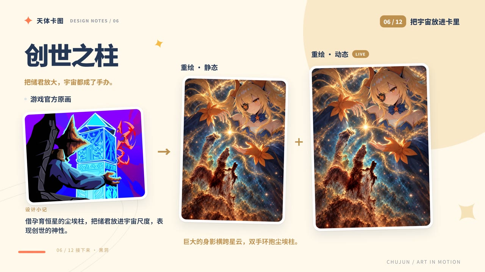
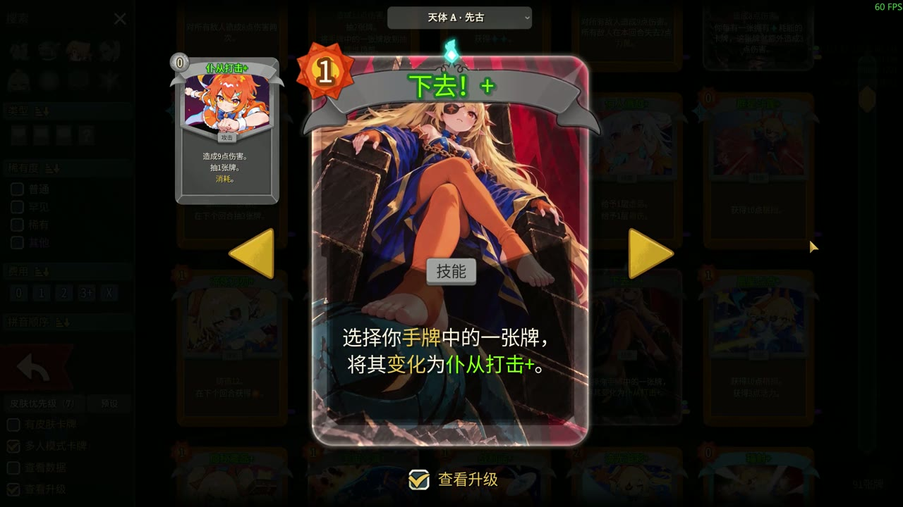

# 天体卡面 · 储君的宇宙小剧场

黑洞要够震撼，星空要够亮，好牌当然要多抓。
这是为储君制作的天体主题卡牌与遗物美术包：让卡名里的奇观有画面，也给她留一点威严、乐子和可爱。**只修改美术显示，不改变卡牌数值与战斗规则。当前公开版本：v1.1.1。**

## 这副牌里有什么？

- 18张卡牌、20套动态画稿；宇宙冷漠、地形改造各有A/B两套。
- 普通卡面与先古全幅均支持动态，可分别选择、预览和调整取景。
- 7件遗物美术，以及13套储君人物素材。
- 动态可在手牌、牌堆、卡组和百科等展示位置播放；开关与播放范围由你选择。

## 十二张代表卡，四种打开方式

完整收录18张，下面选12张聊聊设计思路。

- **气场拉满**：征服者、地形改造、七星。从军帐定策到落子坠星，也有众人改天换地的力量。地形改造的灵感来自广西平陆运河：人民群众，才是地形改造大师！
- **社区整活**：宇宙冷漠、下去！歌词意象和社区梗都能入画，王座上的储君也得有点排面。不喜欢玩梗？宇宙冷漠另有普通版本可选。
- **雄壮天体**：创世之柱、黑洞、彗星、新月长矛。让人物与奇观撑起宇宙的尺度：有时宇宙成了她的手办，有时人小一点，宇宙震撼亿点。
- **可爱表达**：贪婪、光谱偏移、指导。护住金币、变个小戏法、给伙伴上一课——星空之外，还有她的小表情。

以上为介绍视频中的设计展示页；游戏实际效果见下方与本页截图栏。

## 进塔后，也能慢慢看

手牌、抽弃牌堆、卡组与百科都可以欣赏卡面。动态浏览台支持实际卡框与无遮挡大图，可暂停、慢放和拖动时间。7件遗物也沿着储君与仆从的主题重新设计，每件可独立开关。

## 喜欢哪一面，你来选

- 进入「模组设置 → 天体卡面 → 卡面选择与预览」，选择卡牌，再选普通／先古或A/B图稿；右侧同步预览静态与动态，选择即时保存。
- 可以逐卡换回游戏原画。安装[Skin Changer](https://steamcommunity.com/sharedfiles/filedetails/?id=3787302680)后，也能切换该卡的其他可用来源；两边共用单卡选择，SC不是必需前置。
- 「动态卡面」可调整总开关、播放范围与升级条件；浏览台里的欣赏操作不改变对局播放设置。
- 全新配置默认本包主稿、先古全幅，动态和全部播放范围开启，「仅升级后播放」开启；贪婪不可升级，因此不受升级条件限制。更新保留已有偏好。

视频使用本机制作版录制，部分人物皮肤和其他卡面来自下列搭配模组。**视频中的本地图片／视频导入属于制作工具，当前公开版v1.1.1未包含。**公开版提供内置素材库、换图、取景及动态预览功能。

## 安装与推荐搭配

必需前置：[RitsuLib](https://steamcommunity.com/sharedfiles/filedetails/?id=3747602295) 0.5.20或以上。订阅并启用后重启游戏；手动安装与工坊版只保留一份。
[GitHub介绍](https://github.com/Tim-1e/CelestialCardArt) · [完整安装包](https://github.com/Tim-1e/CelestialCardArt/releases/latest)

- [Regent Cards Anime Rework](https://steamcommunity.com/sharedfiles/filedetails/?id=3747626664)：DoublePigeon（两只鸽子）的储君卡图包。本包角色方向受到它的启发；搭配使用，也能覆盖本包未重绘的卡牌。
- [MSGK_Regent](https://steamcommunity.com/sharedfiles/filedetails/?id=3748603697)：储君人物皮肤、相关图标与选人插画。美术：Seic_Oh；动画：DodoBird0615。

以上两项均为可选搭配。重叠卡牌可用Skin Changer或本包设置逐卡选择来源。

## 美术与反馈

非官方同人美术，使用AI辅助生成，并进行选图、修订和取景。角色方向参考DoublePigeon／Anaertalin的相关创作；感谢Mega Crit与社区作者。Slay the Spire 2及游戏角色属于Mega Crit，本模组与其无官方关联。
v1.1.1验证环境为Windows、游戏v0.111.0；已检查18卡、40种图稿/版式组合、原版与SC来源预览、升级规则和播放器释放。所有模组组合未穷尽测试，反馈请附版本、模组列表与复现步骤。

# English — Celestial Card Art v1.1.1

Cosmic spectacles, a little royal attitude, community jokes and the Regent's everyday charm. An artwork-only pack: no changes to card stats or combat rules.

## Contents and showcase

18 cards, 20 animated artworks, 7 relic artworks and 13 character artworks. Cosmic Indifference and Terraforming offer Set A/B choices. Normal and Ancient full-art layouts both support animation. The 12-card showcase above groups selected designs into royal presence, community fun, cosmic scale and cute everyday scenes; the pack includes 18 cards in total. Terraforming draws inspiration from the Pinglu Canal in Guangxi and the collective effort behind a vast engineering project.
The screenshot gallery includes in-game card/relic views, settings and design pages from our introduction video. Character skins and some other cards shown come from the optional companion mods below.

## Settings and installation

Requires [RitsuLib](https://steamcommunity.com/sharedfiles/filedetails/?id=3747602295) 0.5.20+. Restart after installation or updates; keep only one copy if using a manual install. [Manual download](https://github.com/Tim-1e/CelestialCardArt/releases/latest).
Open Mod Settings → 天体卡面 → 卡面选择与预览 to choose a card, layout and artwork, with static/animated previews. The animation settings control playback locations and upgrade requirements; the viewer can pause, slow down and scrub playback. Each relic has its own switch.
Fresh settings use the main Ancient artwork with playback enabled in all supported locations. Upgrade-only playback is on, except for Greed, which cannot be upgraded. Existing preferences are preserved.
[Skin Changer](https://steamcommunity.com/sharedfiles/filedetails/?id=3787302680) is optional and shares per-card choices with this pack. The built-in gallery and cropping tools are included; local image/video importing shown in the authoring setup is NOT included in public v1.1.1.

## Optional companions and credits

[Regent Cards Anime Rework](https://steamcommunity.com/sharedfiles/filedetails/?id=3747626664) by DoublePigeon provides matching artwork for cards outside this pack. [MSGK_Regent](https://steamcommunity.com/sharedfiles/filedetails/?id=3748603697) provides a character skin and related artwork (art: Seic_Oh; animation: DodoBird0615). Use Skin Changer or the per-card settings to choose between overlapping sources.
AI-assisted fan art with selection, revisions and cropping; character direction draws on DoublePigeon / Anaertalin's work. Thanks to the original creators and community authors. Slay the Spire 2 and its characters belong to Mega Crit. This mod is not officially affiliated with Mega Crit.
The mod interface is currently Chinese-only. v1.1.1 was tested on Windows/game v0.111.0; not all mod combinations have been tested. Reports should include versions, mod list and reproduction steps.
