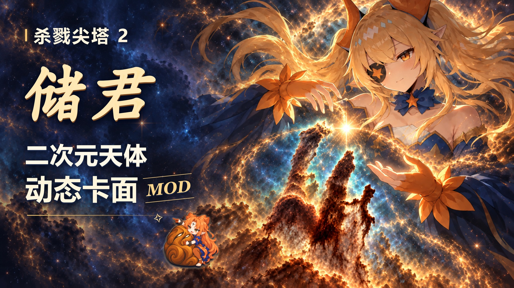
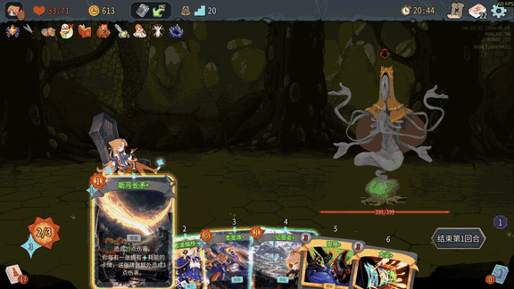
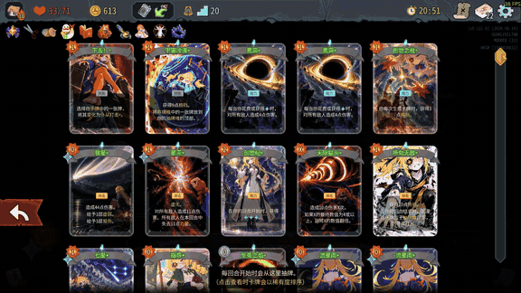
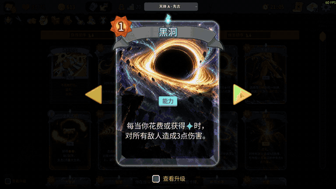
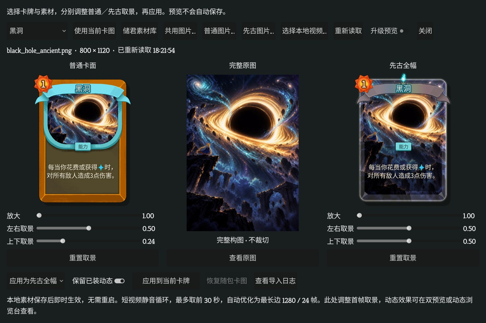
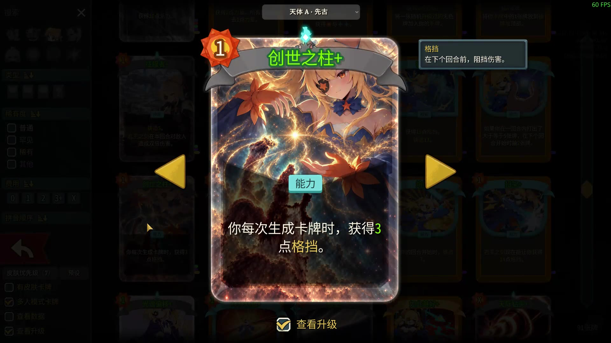
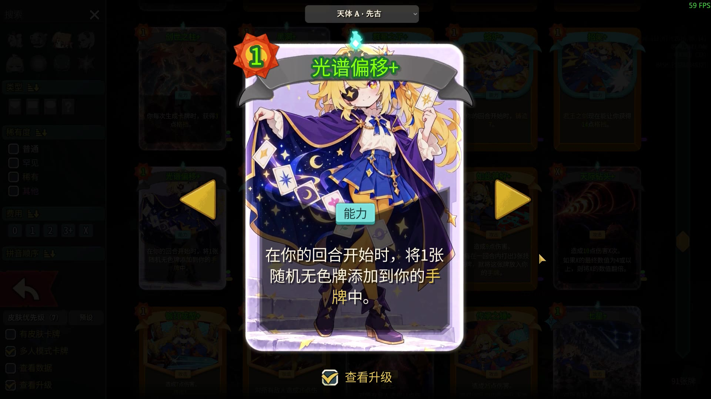
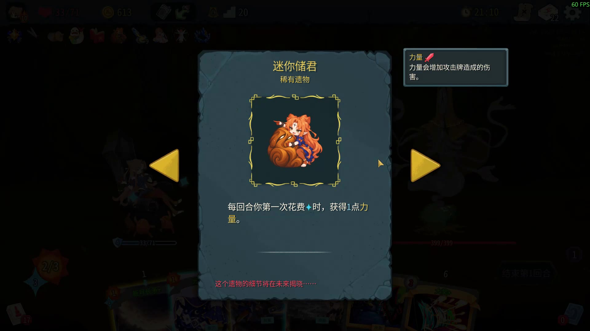
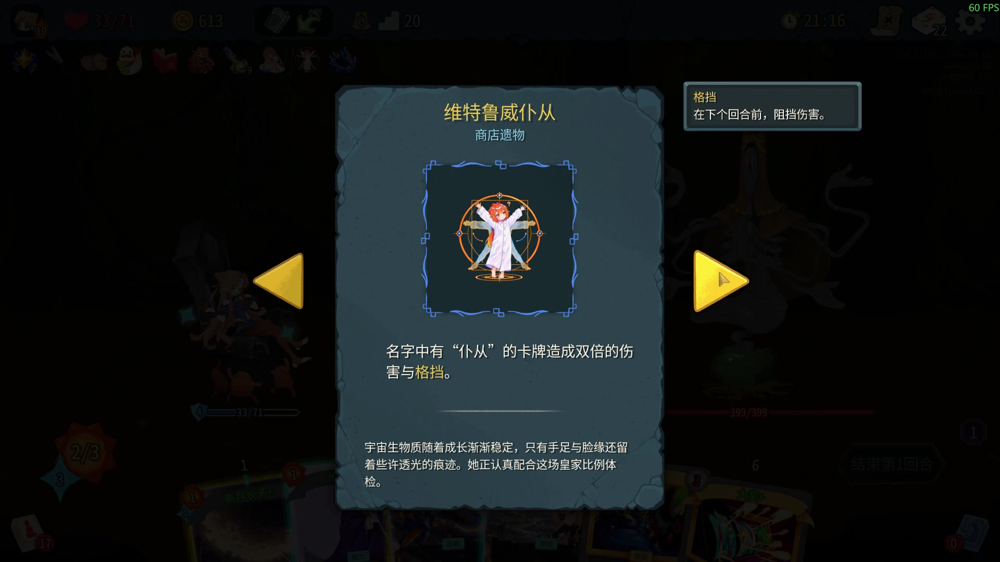

# 天体卡面 · Celestial Card Art

给储君整点大场面。**18张卡牌、20套动态画稿、7件遗物美术、13套人物素材。只换美术，不改数值。**

[Steam 工坊](https://steamcommunity.com/sharedfiles/filedetails/?id=3803362518) · [下载 v1.2.0 完整包](https://github.com/Tim-1e/CelestialCardArt/releases/download/v1.2.0/CelestialCardArt-v1.2.0.zip) · [完整介绍](CelestialCardArt.md) · [全部实机截图与短片](docs/showcase.md)

气场、社区整活、宇宙奇观，还有一点小表情。宇宙冷漠有梗版，也有普通版本；普通／先古都支持动态，每张卡可以自己选。

## v1.2.0：自己的图片和短视频，也能成为卡面

进入「模组设置 → 天体卡面 → 本地卡面与动态导入 → 选择素材／调整取景」。支持为本包卡牌及 A/B 图稿导入图片或短视频；普通与先古分别取景，点击应用即时生效。

- 图片：PNG、JPG/JPEG、WebP；可共用原图或分别指定普通／先古图片。
- 视频：MP4、MOV、MKV、WebM、OGV；随包转换组件支持 Windows x64，无需 Python、PowerShell 或作者工作区。
- 视频静音循环，取前 30 秒，自动优化至最长边 1280 像素、24 fps；仍遵循动画开关、播放位置和升级条件。
- 原素材复制到游戏 `user://CelestialCardArt/imports/`，个人选择保存在 `library-selections.json`。移动原文件或更新模组不会覆盖这些个人素材；可随时恢复随包卡图。
- 导入失败保留原选择。图片最大 64 MB、单边不超过 16384 像素；视频文件最大 2 GB。

## 实机卡面与遗物

这里保留战斗、牌堆、卡组和百科里的实际观看方式。人物皮肤及部分其他卡面来自下方的搭配模组。

[查看21张实机截图、3段循环动图和4段连续短片](docs/showcase.md)。完整介绍视频先看实机，再聊12张代表卡的四类设计思路，最后介绍设置。

## 安装与搭配

1. 订阅 Steam 工坊，或下载 **CelestialCardArt-v1.2.0.zip**，退出游戏后把其中的 `CelestialCardArt` 文件夹放入游戏 `mods` 目录。
2. 安装并启用 [RitsuLib](https://steamcommunity.com/sharedfiles/filedetails/?id=3747602295) 0.5.20 或以上，再重启游戏。手动安装和工坊版只保留一种来源。
3. 在天体卡面设置中选图、预览或导入。安装新版需要重启一次；之后应用个人素材不必重启。

推荐 [Skin Changer](https://steamcommunity.com/sharedfiles/filedetails/?id=3787302680) 管理原版与其他卡面来源。它不是必需前置，两边共享单卡选择。新配置默认本包主稿、先古全幅、动态开启且仅升级后播放；贪婪不能升级，不受该条件限制。已有偏好保留。

可选搭配：[Regent Cards Anime Rework](https://steamcommunity.com/sharedfiles/filedetails/?id=3747626664)（DoublePigeon／两只鸽子，补充其他卡牌）与 [MSGK_Regent](https://steamcommunity.com/sharedfiles/filedetails/?id=3748603697)（人物皮肤；美术 Seic_Oh，动画 DodoBird0615）。

## 发布与验证

本次更新导入功能和展示资料；随包卡图、动画、遗物资源与 v1.1.1 完全相同。未包含作者的本机偏好、个人导入素材、演示存档或制作脚本。

Windows／游戏 v0.111.0 下使用实际公开 DLL 验证了 20 套动画的两种版式、原版及 SC 来源预览、图片和 MP4 导入、开关与升级条件、失败保留原选择、恢复及游戏重启后的播放。界面目前为中文。

`CelestialCardArt/` 与工坊运行包逐文件一致。仓库大文件使用 Git LFS；普通玩家请下载 Release ZIP。Release 附 SHA-256 校验文件，短片与 FFmpeg 源码是独立附件，不必额外安装。

视频转换使用未修改的独立 FFmpeg LGPL v3 构建，许可见 `CelestialCardArt/tools/`。[对应源码、构建信息与依赖构建脚本](https://github.com/Tim-1e/CelestialCardArt/releases/tag/v1.2.0)随同版本提供。

## English

Artwork-only mod for Slay the Spire 2: 18 cards, 20 animated artworks, 7 relics and 13 character artworks. Normal and Ancient layouts both support animation; there are no stat or combat-rule changes.

**v1.2.0 adds personal image/video import to the public build.** Supported images: PNG/JPEG/WebP. Supported videos: MP4/MOV/MKV/WebM/OGV, using the bundled Windows x64 converter. Videos play silently, loop, and are limited to the first 30 seconds at a maximum 1280-pixel edge and 24 fps. Per-layout crops, instant application, private persistent storage and restore-to-bundled-art are included. Animation preferences still apply.

Download the mod ZIP from [Releases](https://github.com/Tim-1e/CelestialCardArt/releases/latest), close the game and extract the `CelestialCardArt` folder into `mods`. Enable RitsuLib 0.5.20+ and restart. Keep one installed copy. Skin Changer is optional; existing preferences are preserved. The UI is currently Chinese. See [showcase clips](docs/showcase.md) and [full details](CelestialCardArt.md).

AI-assisted unofficial fan art, with selection, revisions and cropping. Character direction draws on DoublePigeon / Anaertalin's work; companion-mod credits are listed above. Slay the Spire 2 and its characters belong to Mega Crit; this mod is not officially affiliated with Mega Crit.
