# 实机展示：从开战到百科

以下取自同一套介绍视频素材。实机画面包含可选人物皮肤与其他卡牌模组；详见[首页署名](../README.md)。短片保持原素材顺序，静音，1080p/30 fps。

## 四段连续短片

- [开战与静态手牌 · 26秒](https://github.com/Tim-1e/CelestialCardArt/releases/download/v1.2.0/Showcase-01-battle.mp4)
- [动态牌堆与卡组 · 21秒](https://github.com/Tim-1e/CelestialCardArt/releases/download/v1.2.0/Showcase-02-piles-and-deck.mp4)
- [百科连续浏览 · 30秒](https://github.com/Tim-1e/CelestialCardArt/releases/download/v1.2.0/Showcase-03-encyclopedia.mp4)
- [五件遗物实机介绍 · 32秒](https://github.com/Tim-1e/CelestialCardArt/releases/download/v1.2.0/Showcase-04-relics.mp4)

## 战斗、牌堆与卡组

战斗开始

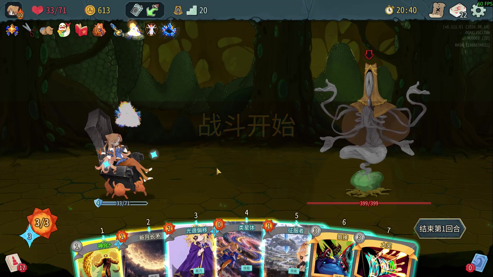

战斗手牌·光谱偏移

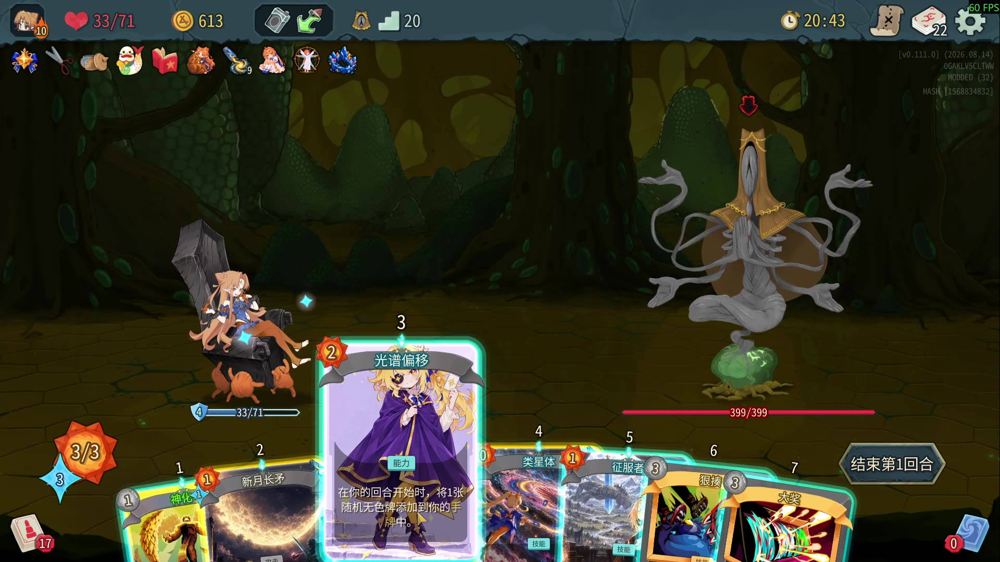

战斗手牌·黑洞

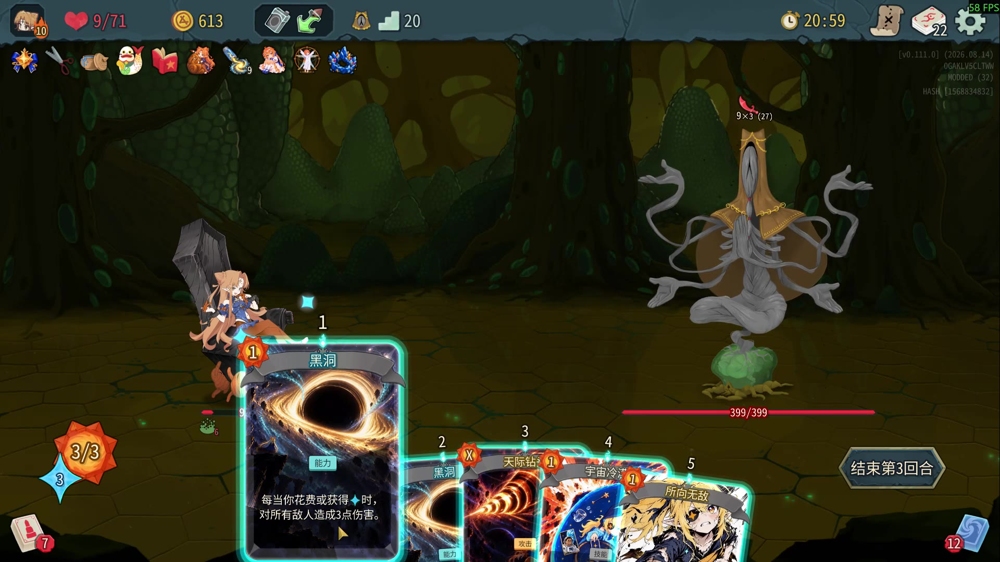

抽牌堆·静态卡面

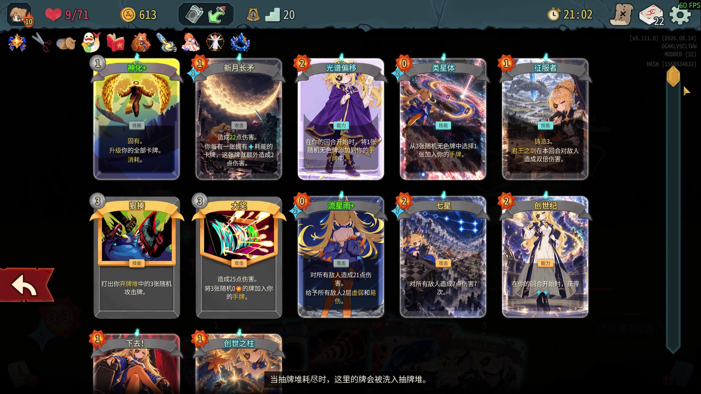

弃牌堆·静态卡面

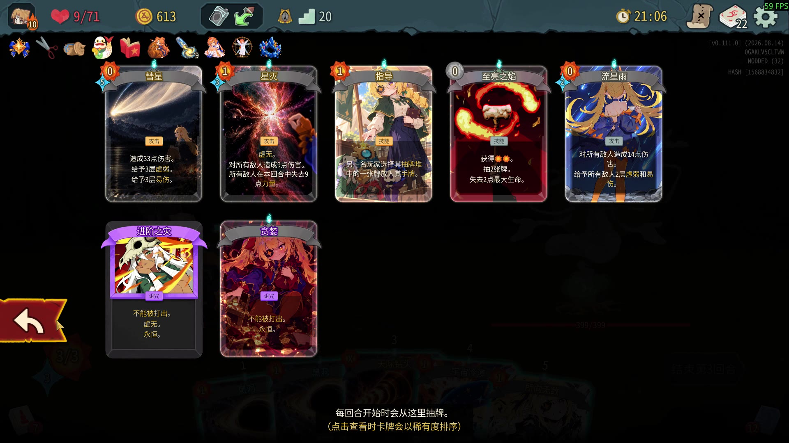

牌堆·动态卡面

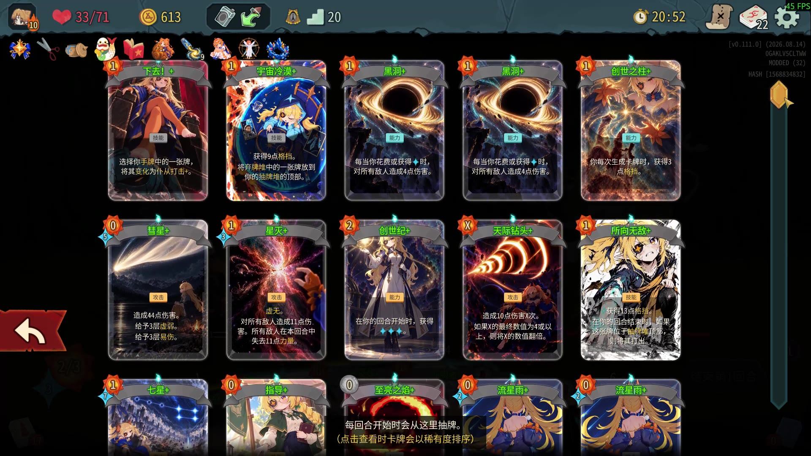

卡组概览

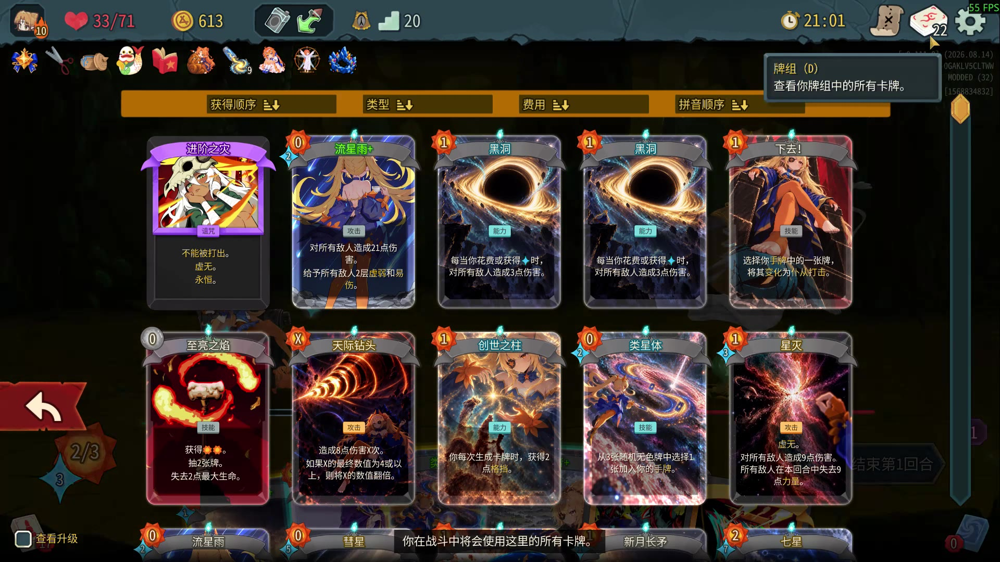

## 百科与卡面详情

黑洞·局内详情

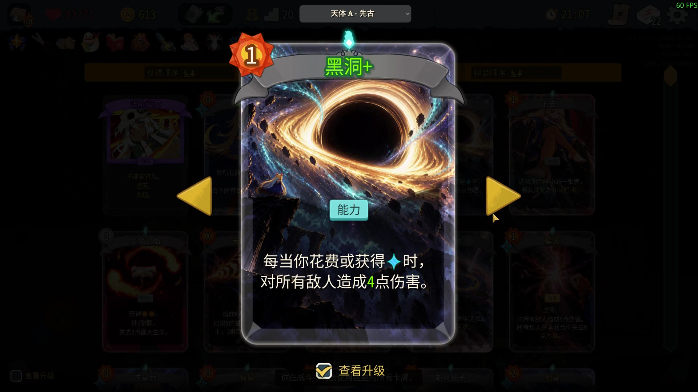

百科·卡牌总览

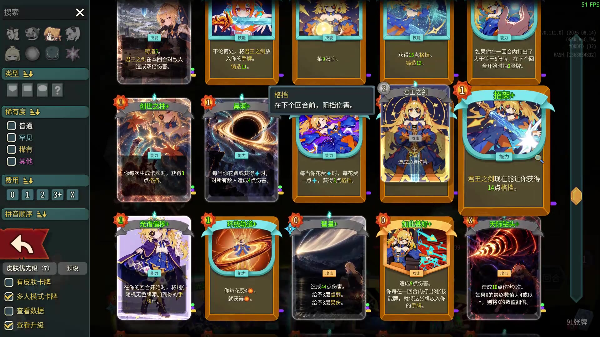

类星体

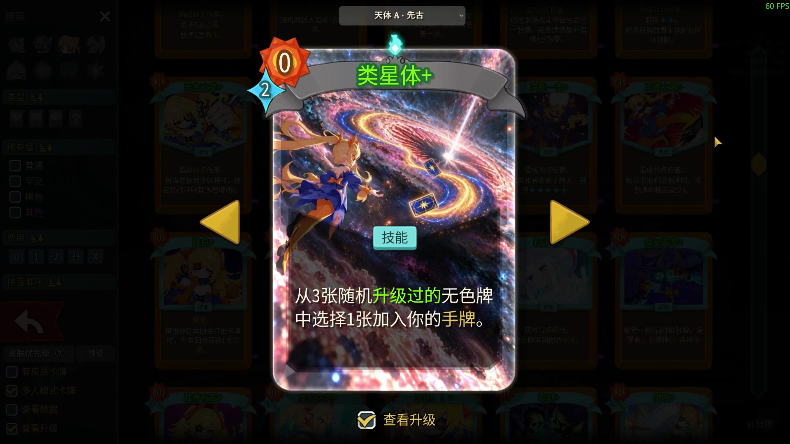

地形改造

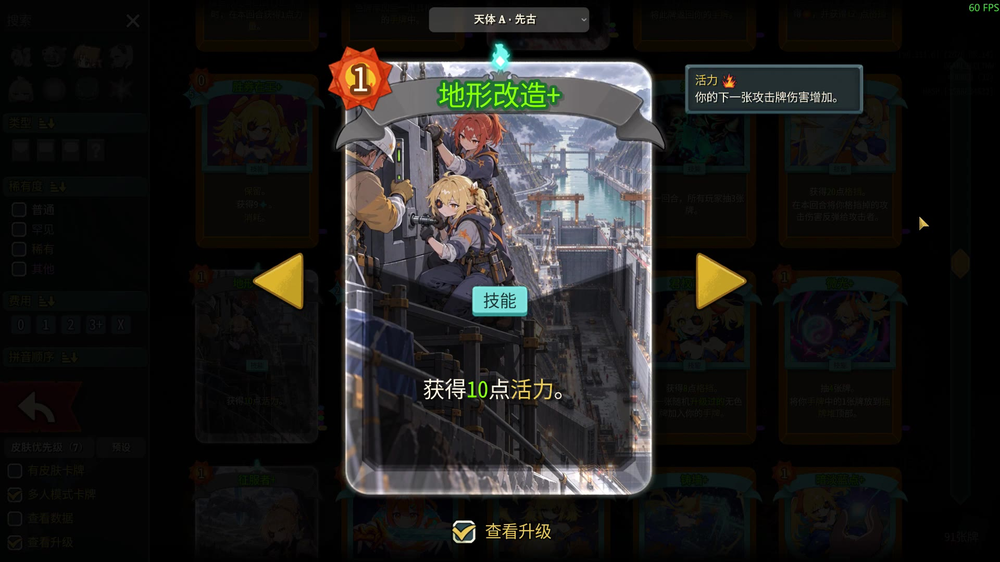

创世之柱

光谱偏移

彗星

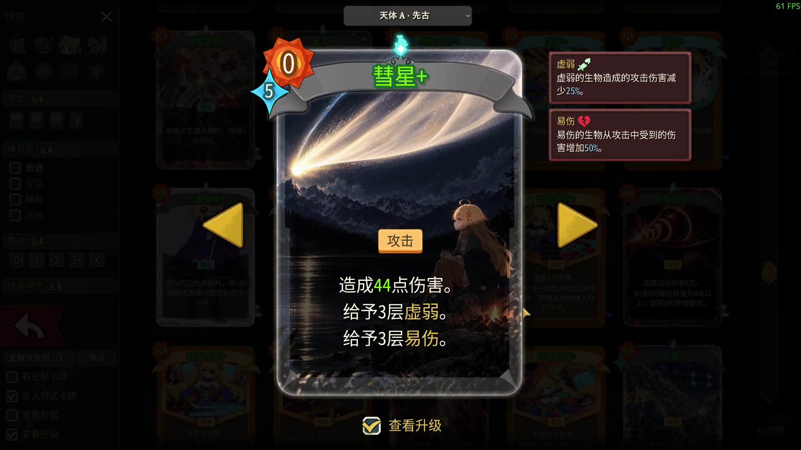

七星

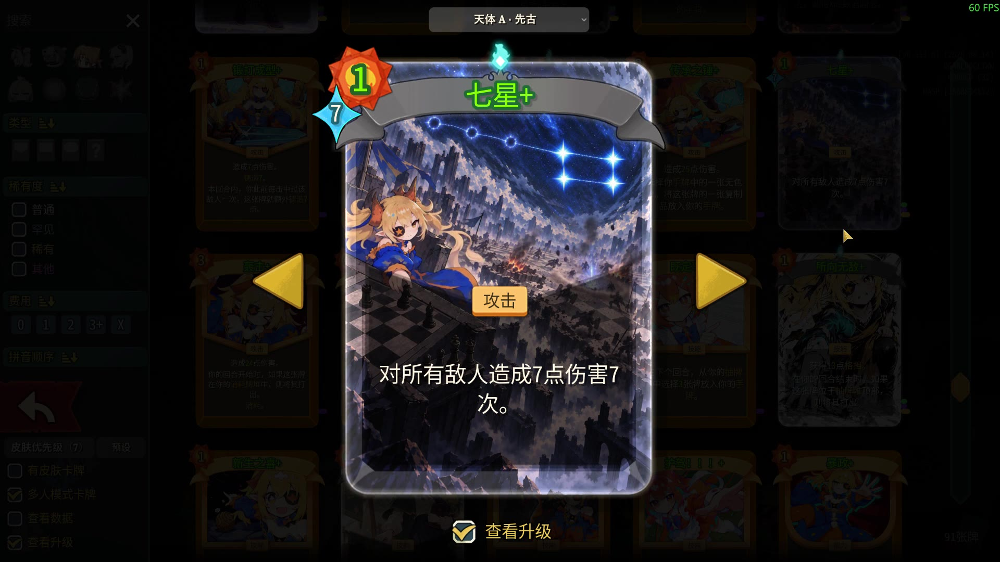

创世纪

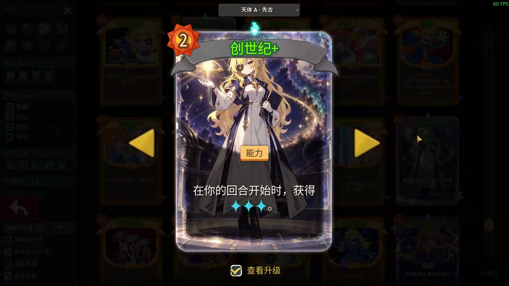

## 遗物的游戏内详情

迷你储君

星系尘埃

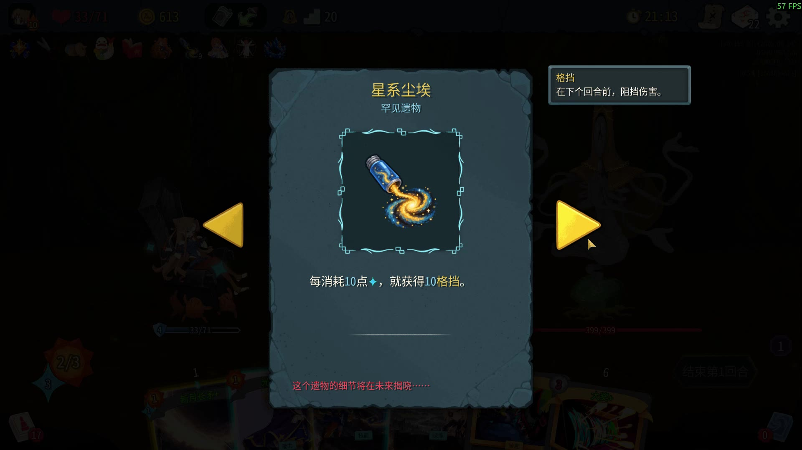

橙色团块

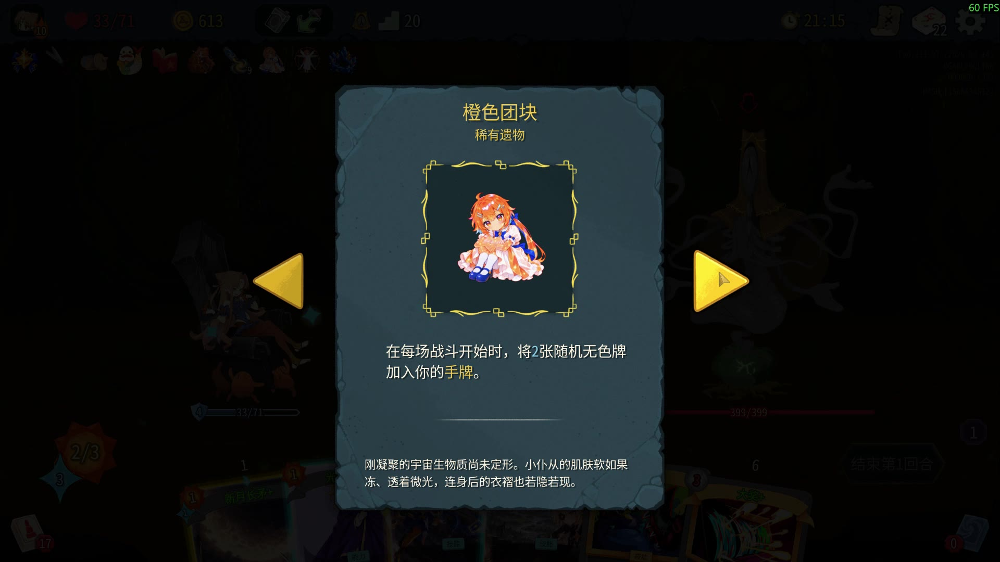

维特鲁威仆从

君王矿石

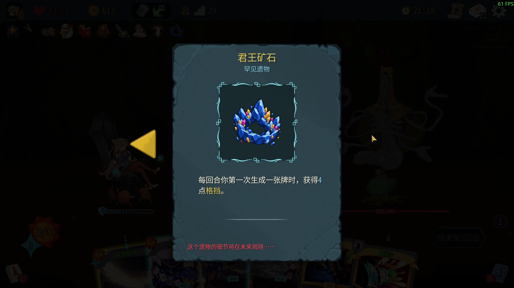
